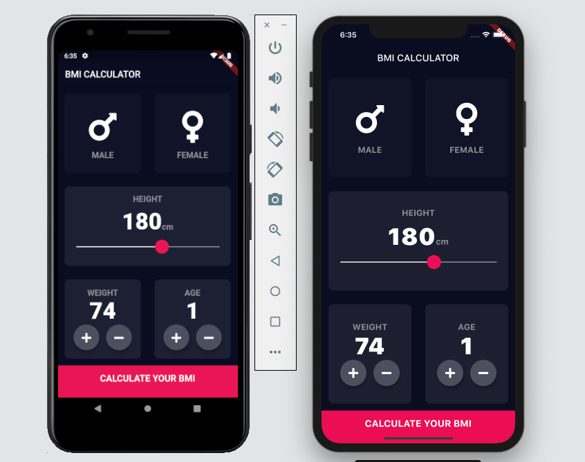
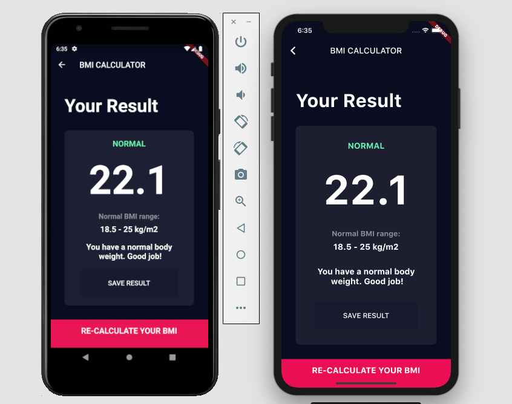

# BMI Calculator 💪

A Body Mass Index Calculator inspired by the beautiful designs made by [Ruben Vaalt](https://dribbble.com/shots/4585382-Simple-BMI-Calculator). It's a multi screen app with simple functionality but full-on custom styling. 

## Getting Started

Fork the project and run on your device 

## Prerequisites

Ability to fork a project 🙂

## What i learnt

- How to use Flutter themes to create coherent branding. 
- How to create multi-page apps using Flutter Routes and Navigator.
- How to extract and refactor Flutter Widgets with a click of the button. 
- How to pass functions as parameters and fields.
- How to use the GestureDetector Widget to detect more than just a tap.
- How to use custom colour palettes by using hex codes.
- How to customise Flutter Widgets to achieve a specific design style.
- Understand Dart Enums and the Ternary Operator.
- Learn about composition vs. inheritance and the Flutter way of creating custom UI.
- Understand the difference between const and final in Dart and when to use each.

## Screen shots

Home screen

Result screen

## Acknowledgments

This is a companion project to The App Brewery's Complete App Development Bootcamp, check out the full course at [www.appbrewery.co](https://www.appbrewery.co/)

